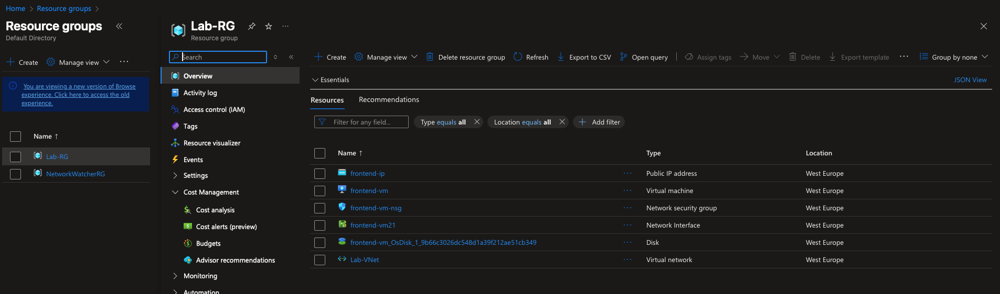
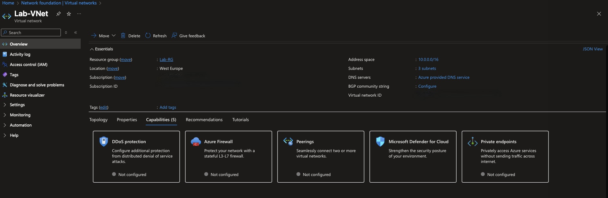
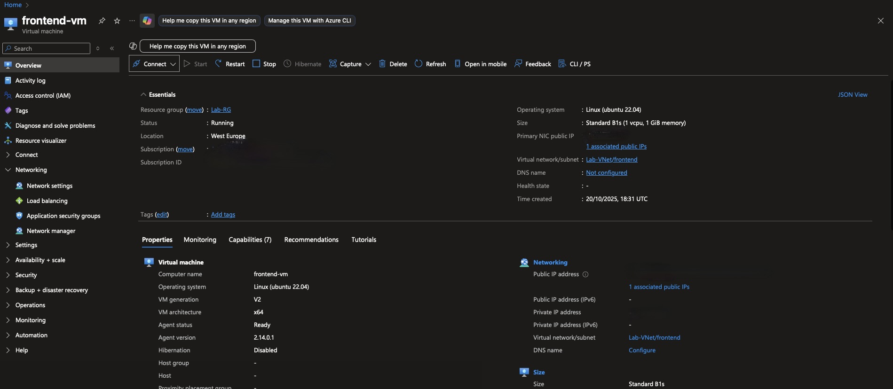
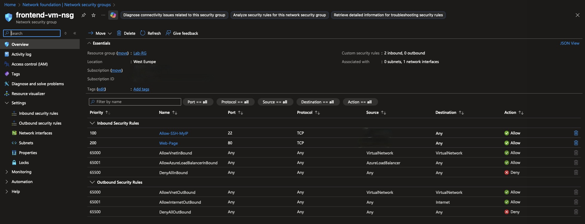
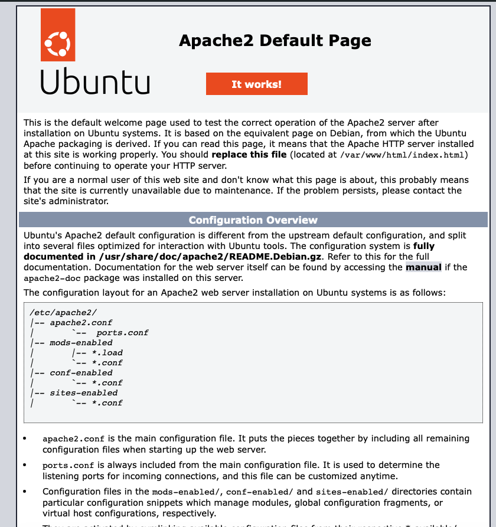
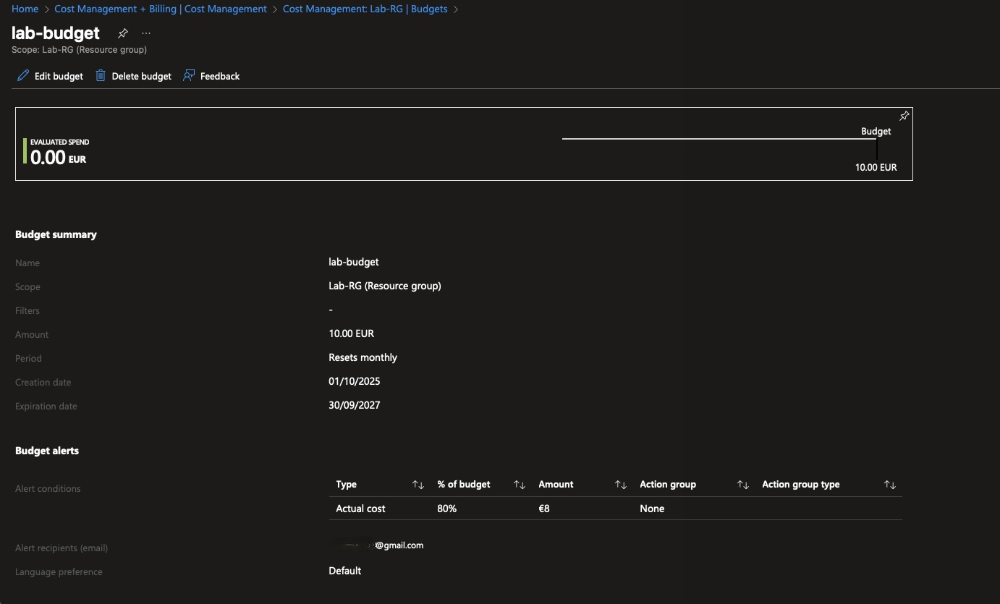
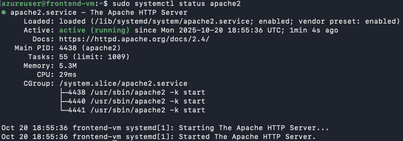

# 🧩 Azure Secure Infrastructure Lab

---

## 🎯 Objective
Deploy a **secure and cost-controlled infrastructure** in Microsoft Azure — combining networking, virtual machines, access control, and cost governance.

---

## ⚙️ Architecture Overview
| Component | Description |
|------------|-------------|
| **Resource Group** | `Lab-RG` |
| **Region** | West Europe |
| **Virtual Network** | `Lab-VNet` (`10.0.0.0/16`) |
| **Subnets** | `frontend (10.0.1.0/24)` • `backend (10.0.2.0/24)` |
| **VM** | Ubuntu Server 22.04 LTS (B1s) |
| **NSG** | Custom rules: SSH (22) only from my IP, HTTP (80) allowed |
| **Governance** | Azure Budget (10 EUR/month, 80% alert threshold) |

---

## 🧱 Steps Summary
1. **Created Resource Group** `Lab-RG`  

2. **Deployed Virtual Network** `Lab-VNet` with `frontend` and `backend` subnets  

3. **Created VM** `frontend-vm` in the `frontend` subnet (Ubuntu 22.04 LTS)  

4. **Configured NSG** `frontend-nsg` →  
   - SSH (22) allowed **only** from my IP  
   - HTTP (80) allowed for testing Apache  

5. **Installed Apache2** and verified access via browser (`http://<public-ip>`)  

6. **Created Budget + Alert** (10 EUR/month, 80%) for cost control  

7. **Validated** all connections and tested governance  

---

## 🔒 Security Highlights
- No inbound ports open by default at deployment  
- Manual NSG configuration ensures least privilege access  
- Tagged and budgeted for full cost governance  
- Public IP restricted by rule, not globally exposed  

---

## 📊 Results
Infrastructure successfully deployed and verified.

| Test | Status |
|------|---------|
| SSH connection (restricted IP) | ✅ Working |
| HTTP Apache page | ✅ Accessible |
| Budget alert (80%) | ✅ Configured |
| NSG rules | ✅ Verified |

👤 Author

Xavier Mota
